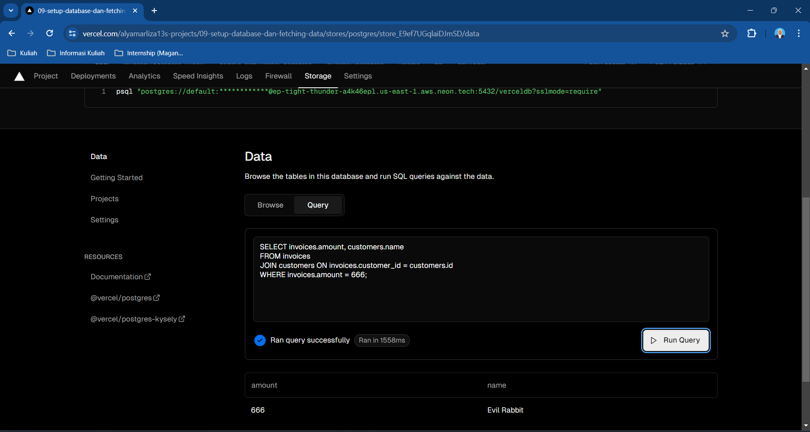

# **Laporan Praktikum Pertemuan 09: Setup Database dan Fetching Data**
## **Mata Kuliah Pemrograman Berbasis Framework 2023 Semester Genap**

| **Dosen Pembina** | Habibie Ed Dien, S.Kom., M.T. |
|--|-----|

| **Nama** | Alya Marliza Koesnanto |
|--|-----|
| **No. Absen/NIM** | 03 - 2141720004 |
| **Kelas** | TI-3A |

### **Praktikum 1: Setup Database**

* **Soal 1**
> **Hasil Laporan Soal 1**
> 
>Berikut adalah hasil dari deploy project saya pada Vercel.

* **Soal 2**
> **Hasil Laporan Soal 2**
> 
>Berikut adalah hasil dari setup database untuk project saya pada Vercel menggunakan postgres.

* **Soal 3**
> **Hasil Laporan Soal 3**
> 
>Berikut adalah hasil dari setup seed pada database untuk project saya pada Vercel menggunakan mengeksekusi file "seed.js".

* **Soal 4**
> **Hasil Laporan Soal 4**
> 
>Berikut adalah hasil dari eksekusi kueri SQL pada penyimpanan basis data di Vercel saya.

### **Praktikum 2: Fetching Data (API)**

* **Soal 5**
> **Hasil Laporan Soal 5**
> 
>Berikut adalah hasil dari push semua kode pemrograman dan hasil deploy dashboard
>
>**Via Vercel**

>
>**Via Google Chrome**
